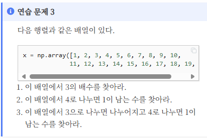
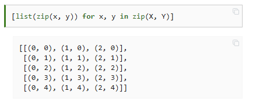

# WIL 3주차 - numpy
## 1. 배열 인덱싱에서 여러 조건을 사용할때

이 문제에서 3번을 풀 때 `x%3 == 0` 조건과 `x%4 == 1`을 교집합 관계로 묶어 사용해야 한다. 그러나 이때 둘을 결합하는 과정에서 `and` 와 `&` 중 `&`만 사용할 수 있다. 
### 상세설명(내 예상)
먼저 `x%3 == 0` 이라는 조건부 연산자는 `numpy.ndarray`의 형태로 결과가 출력된다.

이때 vectorized operation 측면에서 차이가 생긴다. `numpy.ndarray`가 `and`에 대해서는 지원하지 않지만 `&`에 대해서는 지원한다. 따라서 `&` 에 대해서는 각 요소에 대해 AND 연산이 되어 원하는 결과가 도출되지만, `and`는 에러가 발생한다.

## 2. meshgrid
2차원 좌표점을 만들때 간단히 사용할 수 있는 함수이다.
```python
x = np.arange(3)
y = np.arange(5)
X,Y = np.meshgrid(x,y)
```
이러면 `X`에는 x축 방향의 인덱스 위치를 나타내게 되고, `Y`는 y축 방향의 인덱스를 나타내게 된다. 이걸 좌표로 사용하기 위해서는 `zip()`을 2번 사용하면 된다.


## 사분위수
`np.percentile`로 사분위수를 계산할 수 있다.
```python
np.percentile(데이터,%분위수)
```
분위수가 0이면 최소값, 100이면 최대값이 된다.

## `bincount`
정수인 경우에 `bincount`를 사용하면 범위 내에서는 발생하지 않은 수도 빈도를 0이라고 기록해준다. `unique`가 발생한 요소들에 대해서만 기록을 해 주는 것과는 다르다.

예를 들어 
```python
a = np.array([1,1,2,3,4,7])
```
이면 `np.unique`는 5와 6이 없다는 것을 빈도에 기록하지 않지만, `np.bincount`는 5와 6의 빈도가 0이라는 것을 명시해준다.